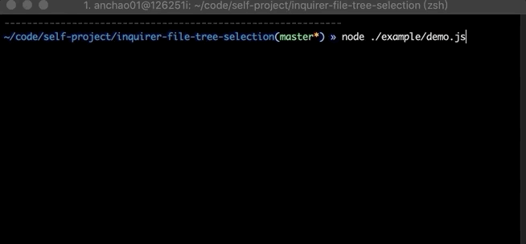
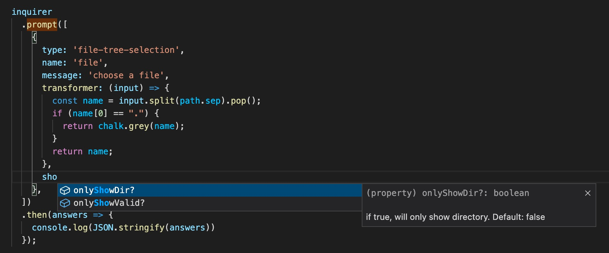

## Inquirer File Tree Selection Prompt

[](https://github.com/anc95/inquirer-file-tree-selection/actions/workflows/npm-publish.yml)

### QuickDemo


### Install
```sh
npm install inquirer-file-tree-selection-prompt
```

> If you are still using CJS, please install `inquirer-file-tree-selection-prompt@^1`

### Usage
```js
inquirer.registerPrompt('file-tree-selection', inquirerFileTreeSelection)

inquirer.prompt({
  type: 'file-tree-selection',
  ...
})
```

### Options
Takes `type`, `name`, `message`, [`filter`, `validate`, `transformer`, `default`, `pageSize`, `onlyShowDir`, `onlyShowValid`, `hideChildrenOfValid`, `root`, `hideRoot`, `multiple`, `enableGoUpperDirector`] properties.

The extra options that this plugin provides are:
- `onlyShowDir`:  (Boolean) if true, will only show directory. Default: false.
- `root`: (String) it is the root of file tree. Default: process.cwd(). 
- `onlyShowValid`: (Boolean) if true, will only show valid files (if `validate` is provided). Default: false.
- `hideChildrenOfValid`: (Boolean) if true, will hide children of valid directories (if `validate` is provided). Default: false.
- `transformer`: (Function) a hook function to transform the display of directory or file name.
- `multiple`: (Boolean) if true, will enable to select multiple files. Default: false.
- `enableGoUpperDirectory`: (Boolean) Show `..` in inside root dir, and the user can press **space** on it to go upper directory. Default: false.

When `multiple` is enabled, `default` should be `string[]` type, otherwise it's `string` type.
### Typescript Support

> version >= 1.0.16

1. Install `@types/inquirer`

2. Ensure you have registered with `file-tree-selection`

```js
inquirer.registerPrompt('file-tree-selection', inquirerFileTreeSelection)
```

3. And you will get type support when you code in IDE



### Example

ESM (version ^2)

```js
import inquirer from 'inquirer'
import inquirerFileTreeSelection from 'inquirer-file-tree-selection-prompt'

inquirer.registerPrompt('file-tree-selection', inquirerFileTreeSelection)

inquirer
  .prompt([
    {
      type: 'file-tree-selection',
      name: 'file'
    }
  ])
  .then(answers => {
    console.log(JSON.stringify(answers))
  });
```

CJS (version ^1 and <2)

```js
const inquirer = require('inquirer')
const inquirerFileTreeSelection = require('inquirer-file-tree-selection-prompt')

inquirer.registerPrompt('file-tree-selection', inquirerFileTreeSelection)

inquirer
  .prompt([
    {
      type: 'file-tree-selection',
      name: 'file'
    }
  ])
  .then(answers => {
    console.log(JSON.stringify(answers))
  });
```

[More examples](./example/)